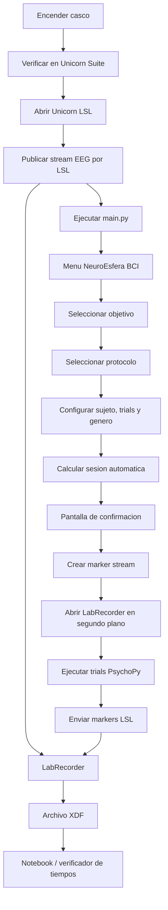

# Manual de usuario NeuroEsfera BCI

## Informacion del documento

**Software:** NeuroEsfera BCI
**Version del entorno:** Python 3.10
**Sistema operativo recomendado:** Windows 10/11
**Formato de salida:** XDF
**Equipo EEG:** Unicorn Hybrid Black
**Librerias principales:** PsychoPy, pylsl
**Herramientas externas:** Unicorn LSL, LabRecorder

Este manual describe el procedimiento para preparar el equipo, ejecutar el
software NeuroEsfera BCI, adquirir una sesion EEG y verificar los archivos
generados.

## 1. Objetivo del software

NeuroEsfera BCI es una aplicacion experimental para adquisicion de senales EEG.
El sistema presenta estimulos visuales y auditivos mediante PsychoPy, envia
marcadores por LSL y guarda la actividad EEG junto con los marcadores en un
archivo XDF usando LabRecorder.

El software esta pensado para construir un dataset sincronizado que luego pueda
ser analizado en notebooks, herramientas EEG o pipelines de clasificacion.

Actualmente el sistema se enfoca en:

- Adquisicion de EEG.
- Presentacion controlada de estimulos.
- Envio de marcadores LSL.
- Grabacion automatica en XDF.
- Organizacion del dataset por objetivo, protocolo, genero y sujeto.
- Verificacion posterior de tiempos mediante timestamps de markers.

El software no realiza clasificacion BCI online en esta version.

## 2. Requisitos previos

Antes de ejecutar el experimento se debe contar con:

- Computador con Windows.
- Python 3.10 instalado.
- Entorno virtual `.venv` creado en la carpeta del proyecto.
- Unicorn Suite Hybrid Black instalado.
- Unicorn LSL instalado.
- LabRecorder instalado.
- Casco Unicorn Hybrid Black cargado y funcional.
- Dongle Bluetooth del casco conectado.
- Electrodos, gel conductor y accesorios para mastoides.

La ruta esperada de LabRecorder se configura en:

```text
core/config.py
```

Por defecto, el proyecto espera encontrar LabRecorder en:

```text
C:\LSL\LabRecorder\LabRecorder.exe
```

Si LabRecorder esta en otra carpeta, se debe actualizar la variable
`LABRECORDER_PATH`.

## 3. Instalacion del entorno

Desde PowerShell, ubicarse en la carpeta del proyecto:

```powershell
cd C:\Proyects\BCI_workspace\BCI
```

Crear el entorno virtual con Python 3.10:

```powershell
py -3.10 -m venv .venv
```

Activar el entorno:

```powershell
.\.venv\Scripts\Activate.ps1
```

Instalar dependencias:

```powershell
.\.venv\Scripts\python.exe -m pip install -r requirements.txt
```

Si PowerShell bloquea la activacion del entorno, ejecutar:

```powershell
Set-ExecutionPolicy -Scope Process -ExecutionPolicy RemoteSigned
```

Luego activar nuevamente:

```powershell
.\.venv\Scripts\Activate.ps1
```

## 4. Preparacion del casco EEG

### 4.1 Posicion de electrodos

El proyecto usa el siguiente mapeo para los 8 canales EEG del Unicorn Hybrid
Black:

```text
Canal 1 -> Fz
Canal 2 -> C3
Canal 3 -> Cz
Canal 4 -> C4
Canal 5 -> Pz
Canal 6 -> PO7
Canal 7 -> Oz
Canal 8 -> PO8
```

Tambien se deben ubicar correctamente los electrodos de referencia/mastoides
izquierdo y derecho, respetando las marcas `L` y `R`.

**Figura sugerida 1.** Posicionamiento del casco y electrodos.

### 4.2 Verificacion en Unicorn Suite

Antes de usar Unicorn LSL, se recomienda abrir Unicorn Suite Hybrid Black para
verificar:

- Que el casco se conecta correctamente.
- Que los indicadores del dispositivo aparecen en verde.
- Que las senales EEG se ven estables.
- Que los electrodos tienen buena impedancia/contacto.

Si la conexion no aparece:

- Revisar que el casco este encendido.
- Revisar que el dongle Bluetooth este conectado.
- Cambiar el dongle a otro puerto USB.
- Reiniciar el casco.
- Reiniciar el computador si el problema persiste.

**Figura sugerida 2.** Verificacion de conexion en Unicorn Suite.

## 5. Publicacion del stream EEG por LSL

Cuando el casco ya esta preparado, abrir Unicorn LSL.

Pasos:

1. Seleccionar el dispositivo disponible, por ejemplo `UN-2019.06.47`.
2. Presionar `Open`.
3. Presionar `Start`.
4. Mantener Unicorn LSL abierto durante toda la adquisicion.

Se recomienda usar la opcion que publica cada tipo de senal por separado cuando
este disponible, porque facilita identificar el stream EEG de 8 canales. En
algunas versiones de Unicorn LSL esta opcion aparece como:

```text
send each signal in one stream
```

Con esta configuracion suelen aparecer streams como:

```text
UN-2019.06.47_EEG
UN-2019.06.47_ACC
UN-2019.06.47_GYR
UN-2019.06.47_BAT
UN-2019.06.47_CNT
UN-2019.06.47_VALID
```

Si se usa:

```text
send all signals in one stream
```

puede aparecer un unico stream tipo `Data` con mas canales. El sistema puede
grabarlo, pero para inspeccion EEG es mas claro trabajar con el stream separado
`EEG` cuando este disponible.

**Figura sugerida 3.** Ventana de Unicorn LSL con el casco conectado.

## 6. Verificacion de streams LSL

Antes de iniciar una sesion real, se puede verificar que el stream LSL sea
visible desde el proyecto.

Ejecutar:

```powershell
.\.venv\Scripts\python.exe tests\inspect_lsl_stream.py
```

El script mostrara los streams encontrados, por ejemplo:

```text
Streams encontrados: 7

[0] nombre=UN-2019.06.47_EEG | tipo=EEG | canales=8
[1] nombre=UN-2019.06.47_ACC | tipo=ACC | canales=3
[2] nombre=UN-2019.06.47_GYR | tipo=GYR | canales=3
```

Si no aparece ningun stream:

- Confirmar que Unicorn LSL esta abierto.
- Confirmar que se presiono `Start`.
- Confirmar que el casco esta encendido.
- Repetir el script.

## 7. Ejecucion del software

Para iniciar NeuroEsfera BCI:

```powershell
.\.venv\Scripts\python.exe main.py
```

Al abrirse la aplicacion, PsychoPy puede mostrar el mensaje:

```text
Attempting to measure frame rate of screen, please wait ...
```

Esto es normal. PsychoPy esta midiendo la tasa de refresco de la pantalla para
sincronizar mejor los estimulos visuales.

## 8. Menu principal

En el menu principal se selecciona primero el objetivo de clasificacion:

- `Arm vs Leg`: clases brazo vs pierna.
- `Left vs Right`: clases izquierda vs derecha.

Luego se selecciona el experimento:

- `Experimento 1`: Motor Imagery
- `Experimento 2`: Action Words
- `Experimento 3`: Motor Observation
- `Experimento 4`: MI + AW + MO

**Figura sugerida 4.** Menu principal de NeuroEsfera BCI.

## 9. Configuracion de la sesion

Luego de seleccionar un protocolo, el software muestra la pantalla de
configuracion.

En esta pantalla se define:

- Numero de sujeto.
- Genero de los videos de Motor Observation.

El numero de trials por clase no se selecciona manualmente. Todos los
experimentos usan por defecto:

```text
10 trials por clase
```

El numero de sesion ya no se selecciona manualmente. El software lo calcula de
forma automatica leyendo la carpeta del dataset correspondiente.

Ejemplo:

Si se selecciona:

```text
Objetivo: Left vs Right
Protocolo: Action Words
Genero: Hombre
Sujeto: 01
```

El sistema revisa:

```text
dataset/left_vs_right/aw/hombre/1/
```

Si ya existen dos archivos XDF en esa carpeta, la nueva sesion sera:

```text
SESION03
```

La pantalla muestra una vista previa con:

- Sesion automatica.
- Numero total de trials.
- Nombre final del archivo.

**Figura sugerida 5.** Pantalla de configuracion de sesion.

## 10. Pantalla de confirmacion

Antes de iniciar la adquisicion, el sistema muestra un resumen:

- Protocolo.
- Objetivo.
- Genero de videos.
- Sujeto.
- Sesion automatica.
- Trials totales.
- Nombre del archivo XDF.

Para iniciar:

```text
Presionar ESPACIO
```

Para volver:

```text
Presionar ESC
```

**Figura sugerida 6.** Pantalla de confirmacion antes de iniciar.

## 11. Grabacion con LabRecorder

Al iniciar la sesion, el software realiza automaticamente estos pasos:

1. Crea el stream LSL de marcadores `NeuroEsferaMarkers`.
2. Abre LabRecorder en segundo plano.
3. Espera el puerto de control remoto de LabRecorder.
4. Actualiza la lista de streams visibles.
5. Selecciona los streams LSL disponibles.
6. Define la carpeta y el nombre del archivo XDF.
7. Inicia la grabacion.

El usuario no debe abrir LabRecorder manualmente para cada sesion, siempre que
la ruta `LABRECORDER_PATH` este bien configurada.

En consola se vera un mensaje similar:

```text
Marker stream listo
Grabando dataset en: C:\Proyects\BCI_workspace\BCI\dataset\left_vs_right\aw\hombre\1\AW-LR-H-SUJETO01-SESION03-10-030526.xdf
```

## 12. Estructura temporal de un trial

Todos los protocolos usan la misma estructura de trial:

```text
BASELINE  3.0 s   pantalla negra
CUE       1.5 s   estimulo de clase + beep
CROSS     5.0 s   cruz central
ITI       1.5 s   pantalla negra entre trials
```

La duracion total por trial es aproximadamente:

```text
11.0 s
```

Al finalizar todos los trials, aparece el texto:

```text
Fin del experimento
```

durante aproximadamente 3 segundos.

## 13. Marcadores LSL

Durante la sesion, el software envia markers por LSL. Estos markers quedan
guardados dentro del XDF junto con el EEG.

Al inicio de la sesion:

```text
TARGET_LEFT_VS_RIGHT
GENDER_HOMBRE
```

En cada trial:

```text
TRIAL_1
CLASS_RIGHT
BASELINE
CUE
AW_RIGHT
CROSS
ITI
```

Al final:

```text
END
```

Dependiendo del protocolo, el marker de tarea puede ser:

```text
MI_LEFT
MI_RIGHT
AW_LEFT
AW_RIGHT
MO_LEFT
MO_RIGHT
MI_ARM
MI_LEG
AW_ARM_<PALABRA>
AW_LEG_<PALABRA>
MO_ARM
MO_LEG
```

## 14. Protocolos disponibles

### 14.1 Motor Imagery

El participante debe imaginar el movimiento indicado por la cue.

Para `Left vs Right`, se muestran cues como:

```text
IZQUIERDA
DERECHA
```

Para `Arm vs Leg`, se muestran:

```text
BRAZOS
PIERNAS
```

### 14.2 Action Words

El participante observa palabras de accion.

Para `Left vs Right`, se muestran:

```text
IZQUIERDA
DERECHA
```

Para `Arm vs Leg`, se muestran palabras asociadas a brazos o piernas, por
ejemplo:

```text
APLAUDIR
CONECTAR
CAMINAR
SALTAR
```

### 14.3 Motor Observation

El participante observa videos relacionados con la clase.

Para `Left vs Right`, se usan videos de brazo izquierdo y brazo derecho:

```text
stimuli/motor_observation/left_vs_right/
```

Para `Arm vs Leg`, se usan videos separados por genero:

```text
stimuli/motor_observation/arm_vs_leg/hombre/
stimuli/motor_observation/arm_vs_leg/mujer/
```

Los videos se muestran en pantalla completa, sin audio.

### 14.4 MI + AW + MO

Este protocolo combina Motor Imagery, Action Words y Motor Observation en una
misma sesion.

El numero total de trials es mayor porque se balancean las clases para las tres
modalidades.

## 15. Aleatorizacion de trials

El sistema genera un plan de trials balanceado segun:

- Objetivo seleccionado.
- Protocolo seleccionado.
- 10 trials por clase configurados por defecto.
- Modalidades incluidas.

Ademas, evita que aparezca la misma clase mas de 3 veces consecutivas.

Ejemplo de secuencia que el sistema intenta evitar:

```text
RIGHT, RIGHT, RIGHT, RIGHT
```

## 16. Archivos generados

Los archivos XDF se guardan en:

```text
dataset/<objetivo>/<protocolo>/<genero>/<sujeto>/
```

Ejemplo:

```text
dataset/left_vs_right/aw/hombre/1/
```

El nombre del archivo usa el formato:

```text
<PROTOCOLO>-<OBJETIVO>-<GENERO>-SUJETO<NN>-SESION<NN>-<TRIALS>-<FECHA>.xdf
```

Ejemplo:

```text
AW-LR-H-SUJETO01-SESION03-10-030526.xdf
```

Significado:

```text
AW        Protocolo Action Words
LR        Objetivo Left vs Right
H         Genero Hombre
SUJETO01  Sujeto 1
SESION03  Tercera sesion detectada automaticamente
10        Trials totales
030526    Fecha en formato ddmmaa
```

Codigos usados:

```text
MI  Motor Imagery
AW  Action Words
MO  Motor Observation
MX  MI + AW + MO
AL  Arm vs Leg
LR  Left vs Right
H   Hombre
M   Mujer
```

## 17. Finalizacion de la sesion

Al finalizar, el software:

1. Envia el marker `END`.
2. Detiene la grabacion de LabRecorder.
3. Cierra el proceso de LabRecorder.
4. Muestra una pantalla de resumen.

La pantalla final muestra:

- Formato de grabacion.
- Nombre del archivo.
- Objetivo.
- Sujeto.
- Sesion.
- Stream EEG detectado.
- Canales.

**Figura sugerida 7.** Pantalla de sesion guardada.

## 18. Verificacion de tiempos

Para demostrar que los tiempos fueron capturados correctamente, usar:

```powershell
.\.venv\Scripts\python.exe tests\verify_xdf_timing.py ruta\al\archivo.xdf
```

Si no se entrega una ruta, el script toma el XDF mas reciente:

```powershell
.\.venv\Scripts\python.exe tests\verify_xdf_timing.py
```

El script compara los timestamps reales de los markers con los tiempos esperados:

```text
BASELINE_TO_CUE    esperado: 3.0 s
CUE_TO_CROSS       esperado: 1.5 s
CROSS_TO_ITI       esperado: 5.0 s
ITI_TO_NEXT_TRIAL  esperado: 1.5 s
```

Esta verificacion sirve como evidencia de sincronizacion temporal.

## 19. Exploracion del dataset

Para revisar los archivos guardados se puede usar el notebook:

```powershell
.\.venv\Scripts\jupyter.exe notebook notebooks\dataset_explorer.ipynb
```

Desde el notebook se puede:

- Seleccionar un archivo XDF.
- Revisar streams dentro del XDF.
- Revisar markers.
- Revisar canales EEG.
- Visualizar senales basicas.

## 20. Cierre correcto del sistema

Al terminar la adquisicion:

1. Cerrar NeuroEsfera BCI.
2. Confirmar que LabRecorder se cerro automaticamente.
3. Detener Unicorn LSL con `Stop`.
4. Cerrar Unicorn LSL.
5. Apagar el casco.
6. Guardar o respaldar los XDF si es necesario.

## 21. Solucion de problemas

### No aparecen streams LSL

Posibles causas:

- El casco esta apagado.
- Unicorn LSL no esta abierto.
- No se presiono `Start` en Unicorn LSL.
- El dongle Bluetooth no esta conectado correctamente.

Solucion:

```powershell
.\.venv\Scripts\python.exe tests\inspect_lsl_stream.py
```

Verificar que aparezca un stream `EEG` o `Data`.

### LabRecorder no inicia

Posibles causas:

- LabRecorder no esta instalado.
- `LABRECORDER_PATH` apunta a una ruta incorrecta.
- Se configuro por error la ruta de UnicornLSL en vez de LabRecorder.

Solucion:

Revisar en:

```text
core/config.py
```

La variable:

```text
LABRECORDER_PATH
```

### El XDF pesa muy poco

Un XDF muy pequeno puede indicar que:

- No habia stream EEG activo.
- LabRecorder grabo solo markers.
- La sesion fue muy corta.
- Unicorn LSL no estaba en `Start`.

Antes de repetir la sesion, inspeccionar streams LSL.

### PsychoPy muestra advertencias de audio

PsychoPy puede mostrar advertencias sobre audio o backend `sdl2`. Si el
experimento corre y el beep se escucha, no necesariamente es un error critico.

Para analisis de tiempos, se recomienda usar los markers del XDF y el script de
verificacion.

### El stream no trae labels reales de electrodos

Algunas versiones de Unicorn LSL no publican metadata con labels de canales. En
ese caso, el proyecto usa el mapeo configurado:

```text
Fz, C3, Cz, C4, Pz, PO7, Oz, PO8
```

Este mapeo debe ser consistente con el montaje fisico del casco.

## 22. Flujo resumido de trabajo

```text
1. Encender casco Unicorn Hybrid Black
2. Verificar senales en Unicorn Suite
3. Abrir Unicorn LSL
4. Seleccionar dispositivo
5. Presionar Open
6. Presionar Start
7. Ejecutar NeuroEsfera BCI
8. Seleccionar objetivo
9. Seleccionar protocolo
10. Configurar trials, sujeto y genero
11. Confirmar sesion automatica
12. Presionar espacio para iniciar
13. Esperar fin del experimento
14. Revisar archivo XDF generado
15. Verificar tiempos si es necesario
16. Explorar dataset en notebook
```

## 23. Diagrama de flujo



## 24. Recomendaciones para una sesion real

Antes de iniciar:

- Confirmar que el sujeto esta comodo.
- Confirmar que el casco no se mueve.
- Confirmar que las senales EEG son estables.
- Confirmar que Unicorn LSL publica el stream.
- Confirmar que no hay otros procesos pesados abiertos.
- Confirmar que la carpeta `dataset/` tiene espacio suficiente.

Durante la sesion:

- Evitar hablarle al sujeto.
- Evitar movimientos innecesarios.
- No cerrar Unicorn LSL.
- No cerrar la ventana de PsychoPy.

Despues de la sesion:

- Revisar que el XDF se genero.
- Revisar que el peso del archivo sea coherente con la duracion.
- Verificar tiempos con `tests/verify_xdf_timing.py`.
- Registrar cualquier incidente experimental.
