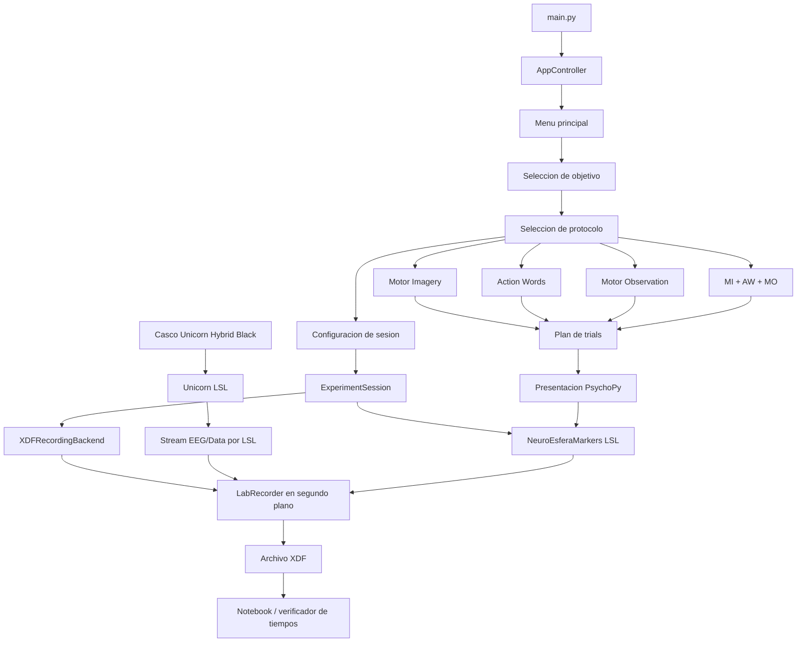

# Flujo de trabajo del software NeuroEsfera BCI

## Proposito del software

NeuroEsfera BCI es un software experimental para adquirir senales EEG con el casco Unicorn Hybrid Black, presentar estimulos controlados con PsychoPy y guardar la sesion completa en formato XDF mediante LabRecorder. El objetivo principal es construir un dataset EEG sincronizado con marcadores experimentales para analisis posterior.

El sistema no realiza clasificacion en tiempo real todavia. Actualmente se enfoca en adquisicion, presentacion de estimulos, sincronizacion por LSL, organizacion del dataset y verificacion de tiempos.

## Flujo operativo

1. El usuario enciende el casco Unicorn Hybrid Black.
2. El usuario abre Unicorn LSL y publica el stream EEG por la red LSL.
3. El usuario ejecuta la aplicacion con `.\.venv\Scripts\python.exe main.py`.
4. `main.py` crea el entorno local de PsychoPy y arranca `AppController`.
5. La interfaz muestra el menu principal.
6. El usuario selecciona el objetivo experimental:
   - `Arm vs Leg`
   - `Left vs Right`
7. El usuario selecciona el experimento:
   - `Experimento 1`: Motor Imagery
   - `Experimento 2`: Action Words
   - `Experimento 3`: Motor Observation
   - `Experimento 4`: MI + AW + MO
8. El usuario configura la sesion:
   - numero de sujeto
   - genero de videos para Motor Observation
9. El sistema usa 10 trials por clase para todos los experimentos.
10. El sistema revisa la carpeta del dataset para esa combinacion de objetivo, protocolo, genero y sujeto.
11. El sistema asigna automaticamente la siguiente sesion disponible y muestra una pantalla de confirmacion.
12. Al presionar espacio, el sistema prepara la sesion:
    - crea el stream LSL de marcadores
    - abre LabRecorder en segundo plano
    - selecciona los streams LSL visibles
    - carga los estimulos necesarios
13. El protocolo ejecuta los trials y envia marcadores por LSL.
14. LabRecorder guarda EEG, marcadores y streams auxiliares en un archivo XDF.
15. Al finalizar, el sistema detiene LabRecorder y muestra un resumen de sesion.
16. El usuario puede inspeccionar el XDF con el notebook o verificar tiempos con `tests/verify_xdf_timing.py`.

## Diagrama de bloques



## Componentes principales

### `main.py`

Es el punto de entrada. Prepara una carpeta local `.psychopy-appdata` para evitar problemas de permisos con PsychoPy y crea el controlador principal de la aplicacion.

### `core/app_controller.py`

Controla el flujo de pantallas:

- menu principal
- configuracion de sesion
- pantalla de sesion lista
- pantalla de preparacion
- pantalla de sesion guardada

Tambien construye el runner correcto segun el protocolo seleccionado y coordina el inicio de la sesion experimental.

### `core/protocol_catalog.py`

Define las opciones disponibles:

- objetivos experimentales: `arm_vs_leg`, `left_vs_right`
- generos de estimulos: `hombre`, `mujer`
- protocolos: `mi`, `aw`, `mo`, `mix`

Tambien define los codigos usados en nombres de archivos, por ejemplo `MI`, `AW`, `MO`, `MX`, `AL`, `LR`, `H`, `M`.

### `core/session_config.py`

Construye la configuracion final de la sesion. A partir del experimento, objetivo, genero, sujeto y 10 trials por clase, genera:

- nombre del protocolo
- codigo del objetivo
- numero automatico de sesion
- numero total de trials
- fecha de sesion
- nombre base del archivo XDF

Ejemplo:

```text
MO-LR-H-SUJETO01-SESION01-10-030526.xdf
```

### `experiments/movement_protocols.py`

Contiene la logica experimental central. Define:

- duracion de cada fase del trial
- palabras de Action Words
- seleccion de videos de Motor Observation
- aleatorizacion balanceada de trials
- limite de maximo 3 clases iguales consecutivas
- marcadores enviados por LSL

Los archivos `motor_imagery.py`, `action_words.py`, `motor_observation.py` y `mixed_protocol.py` son wrappers pequenos que llaman a este modulo central.

### `services/experiment_session.py`

Centraliza el ciclo de vida de una sesion:

- crea el stream de marcadores
- crea el backend de grabacion
- cierra la sesion
- prepara el resumen final para la interfaz

### `services/recording_backend.py`

Controla LabRecorder. El backend:

- encuentra `LabRecorder.exe`
- crea una configuracion temporal con control remoto habilitado
- abre LabRecorder en segundo plano
- se conecta al puerto RCS
- envia comandos como `update`, `select all`, `filename` y `start`
- detiene la grabacion al finalizar

### `eeg/lsl_markers.py`

Crea el stream LSL de marcadores:

```text
name: NeuroEsferaMarkers
type: Markers
channel_count: 1
format: string
```

Cada evento del experimento se envia como una muestra de texto.

### `eeg/stream_metadata.py`

Busca streams EEG/Data visibles en LSL y extrae metadata de canales cuando existe. Si el stream no publica labels reales, usa el mapeo configurado:

```text
Canal 1 -> Fz
Canal 2 -> C3
Canal 3 -> Cz
Canal 4 -> C4
Canal 5 -> Pz
Canal 6 -> PO7
Canal 7 -> Oz
Canal 8 -> PO8
```

## Estructura de un trial

Todos los protocolos usan la misma estructura temporal:

```text
BASELINE  3.0 s   pantalla negra
CUE       1.5 s   estimulo de clase + beep
CROSS     5.0 s   cruz central
ITI       1.5 s   pantalla negra entre trials
```

La secuencia completa se repite para cada trial.

## Marcadores principales

Al inicio de la sesion:

```text
TARGET_LEFT_VS_RIGHT
GENDER_HOMBRE
```

En cada trial:

```text
TRIAL_1
CLASS_RIGHT
BASELINE
CUE
MI_RIGHT / AW_RIGHT / MO_RIGHT
CROSS
ITI
```

Al final:

```text
END
```

Estos marcadores quedan guardados dentro del XDF y permiten reconstruir el flujo experimental durante el analisis.

## Protocolos disponibles

### Motor Imagery

Presenta una cue textual de la clase. En `Left vs Right`, la cue puede ser:

```text
IZQUIERDA
DERECHA
```

En `Arm vs Leg`, la cue puede ser:

```text
BRAZOS
PIERNAS
```

### Action Words

En `Left vs Right`, presenta:

```text
IZQUIERDA
DERECHA
```

En `Arm vs Leg`, selecciona palabras de accion asociadas a brazos o piernas.

### Motor Observation

Presenta videos. Para `Left vs Right`, usa videos de brazo izquierdo o derecho. Para `Arm vs Leg`, usa videos separados por genero:

```text
stimuli/motor_observation/arm_vs_leg/hombre/
stimuli/motor_observation/arm_vs_leg/mujer/
```

Los videos se muestran en pantalla completa.

### MI + AW + MO

Combina los tres tipos de protocolo en una sola sesion, manteniendo la misma estructura temporal y el mismo sistema de marcadores.

## Aleatorizacion de trials

El sistema construye un plan balanceado de trials segun:

- modalidades seleccionadas
- clases del objetivo experimental
- 10 trials por clase configurados por defecto

Ademas, evita que aparezca la misma clase mas de 3 veces consecutivas. Por ejemplo, no deberia generar:

```text
RIGHT, RIGHT, RIGHT, RIGHT
```

## Estructura del dataset

Los archivos XDF se guardan con esta estructura:

```text
dataset/<objetivo>/<protocolo>/<genero>/<sujeto>/
```

Ejemplo:

```text
dataset/left_vs_right/mo/hombre/1/MO-LR-H-SUJETO01-SESION01-10-030526.xdf
```

El nombre del archivo resume:

- protocolo
- objetivo
- genero
- sujeto
- sesion automatica
- numero total de trials
- fecha

Ejemplo del formato actual:

```text
AW-LR-H-SUJETO01-SESION01-10-030526.xdf
```

## Verificacion de tiempos

Para demostrar que los tiempos fueron capturados con precision, se usa:

```powershell
.\.venv\Scripts\python.exe tests\verify_xdf_timing.py ruta\al\archivo.xdf
```

Si no se entrega una ruta, el script usa el XDF mas reciente dentro de `dataset/`:

```powershell
.\.venv\Scripts\python.exe tests\verify_xdf_timing.py
```

El script lee los timestamps reales de los marcadores dentro del XDF y calcula:

```text
BASELINE_TO_CUE    esperado: 3.0 s
CUE_TO_CROSS       esperado: 1.5 s
CROSS_TO_ITI       esperado: 5.0 s
ITI_TO_NEXT_TRIAL  esperado: 1.5 s
```

Esto permite reportar diferencias reales entre los tiempos programados y los tiempos grabados.

## Herramientas auxiliares

### Inspeccion de streams LSL

```powershell
.\.venv\Scripts\python.exe tests\inspect_lsl_stream.py
```

Permite verificar si el casco esta publicando streams, cuantos canales tiene cada stream y si existen labels de electrodos.

### Exploracion de dataset

```powershell
.\.venv\Scripts\jupyter.exe notebook notebooks\dataset_explorer.ipynb
```

Permite abrir un XDF, revisar streams, markers, canales EEG y graficas basicas.
